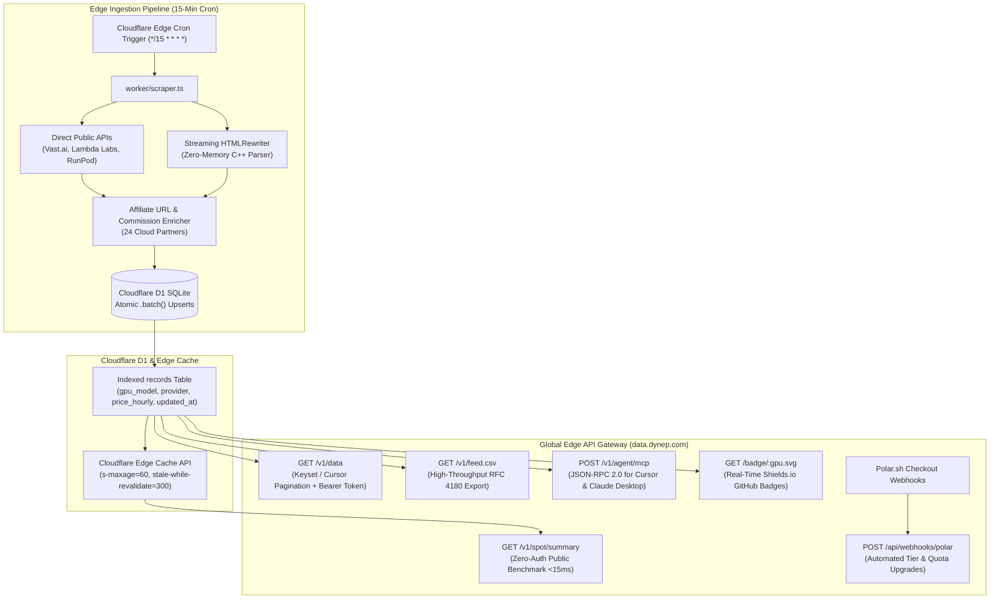

# ⚡ DYNEP // Real-Time Institutional AI Cloud GPU Spot Intelligence & Arbitrage Terminal

> Real-time global spot price indexer, hardware arbitrage terminal, and programmatic Data-as-a-Service (DaaS) engine tracking **31+ AI cloud GPU providers** (AWS, Lambda Labs, RunPod, Vast.ai, LeaderGPU, Vultr, Nebius, CoreWeave, and more).

Live Production Service: **[https://data.dynep.com](https://data.dynep.com)**

[](https://workers.cloudflare.com)
[](https://developers.cloudflare.com/d1/)
[](https://www.npmjs.com/package/dynep-spot)
[](https://pypi.org/project/dynep/)
[](https://modelcontextprotocol.io)
[](https://opensource.org/licenses/MIT)

---

## 🏗️ Architecture Blueprint

DYNEP runs 100% serverless at the global edge on **Cloudflare Workers (V8 Edge)** and **Cloudflare D1 (Distributed SQLite)** with zero external virtual machine or container dependencies.



---

## ⚡ Core Features & Capabilities

1. **Zero-Auth Edge Benchmark (`/v1/spot/summary`):**
   - Returns live spot rates across major AI accelerator families (H100, H200, B200, A100, RTX 4090, L40S) in under 50ms worldwide.
   - Includes real-time arbitrage spreads vs AWS EC2 baseline rates (e.g. saving up to 78% on A100 / H100 SXM5).

2. **Model Context Protocol (MCP) Server for Cursor & Claude Desktop:**
   - Native JSON-RPC 2.0 protocol handler (`POST /v1/agent/mcp`).
   - Query lowest spot prices directly inside your IDE using natural language:
     `"Find the cheapest available 8x H100 cluster for my PyTorch script"`.

3. **Multi-Cloud Ingest Engine:**
   - Ingests structured pricing directly from public provider APIs (Vast.ai REST, RunPod GraphQL, Lambda Labs instance catalog) and fallback HTML tables via native streaming `HTMLRewriter`.
   - Atomic multi-row upserts via Cloudflare D1 `.batch()` to eliminate database write locking.

4. **Dual-Stream Monetization:**
   - **Data-as-a-Service (DaaS):** Tiered programmatic API subscriptions via Polar.sh ($0 Free, $29 Starter, $99 Pro, $299 Enterprise).
   - **Hardware Kickbacks:** Integrated affiliate tracking across **24 GPU cloud partners** (LeaderGPU, RunPod, Vast.ai, Lambda Labs, Vultr, Nebius, FluidStack, etc.) generating 3% to 15% recurring hardware rental commissions.

5. **Live Dynamic GitHub Shields / Badges (`/badge/:gpu.svg`):**
   - Embed real-time pricing badges directly in open-source AI repositories (e.g. `[](https://data.dynep.com)`).

---

## 🚀 Instant Terminal Quickstart

### 1. Query Live Spot Rates (No Auth, No Install)
```bash
curl -s https://data.dynep.com/v1/spot/summary | jq .benchmark_summary
```

### 2. Official CLI (`dynep-spot`)
```bash
# Query market depth for NVIDIA H100
npx dynep-spot --gpu H100

# Claim complimentary 100 req/mo Developer API Key
npx dynep-spot --claim dev@company.com
```

### 3. Model Context Protocol (MCP) Configuration
Add to your `claude_desktop_config.json` or `.cursor/mcp.json`:
```json
{
  "mcpServers": {
    "dynep-spot": {
      "command": "npx",
      "args": ["-y", "dynep-spot", "--mcp"]
    }
  }
}
```

### 4. Official Python SDK (`dynep`)
```bash
pip install dynep
```
```python
from dynep import DynepClient

client = DynepClient()
quote = client.get_cheapest_spot("H100")
print(f"Deploy on {quote.best_provider} for ${quote.spot_rate_hourly_usd}/hr (-{quote.cost_savings_vs_aws_percent} vs AWS)")
print(f"Deploy URL: {quote.deploy_url}")
```

---

## 🛠️ Local Development & Deployment

### Prerequisites
- Node.js 20+
- Cloudflare Wrangler CLI (`wrangler`)
- Cloudflare account with D1 database binding (`dynep-db`)

### 1. Clone & Typecheck
```bash
git clone https://github.com/18roicohen/valiant-newton.git
cd valiant-newton
pnpm install
cmd.exe /c "npx.cmd tsc --noEmit"
```

### 2. Run Test Suite (Vitest)
```bash
cmd.exe /c "npx.cmd vitest run"
```

### 3. Local Edge Emulation
```bash
cmd.exe /c "npx.cmd wrangler dev"
```

### 4. Deploy to Production
```bash
# Set encrypted secrets (one-time setup)
cmd.exe /c "npx.cmd wrangler secret put RESEND_API_KEY"
cmd.exe /c "npx.cmd wrangler secret put ADMIN_API_KEY"

# Deploy Worker & Assets to Cloudflare Edge
cmd.exe /c "npx.cmd wrangler deploy"

# Execute D1 Schema Migrations
cmd.exe /c "npx.cmd wrangler d1 execute dynep-db --file=worker/schema.sql"
```

---

## 📡 API Reference Summary

| Endpoint | Method | Auth | Description |
| :--- | :---: | :---: | :--- |
| `/v1/spot/summary` | `GET` | None | DGX-31 real-time composite benchmark with AWS savings deltas |
| `/v1/spot/instances` | `GET` | None | Paginated live instance table feed with Edge Cache API |
| `/v1/agent/arbitrage` | `GET` | None | Dynamic cluster sizing & monthly cost arbitrage calculation |
| `/v1/agent/mcp` | `POST` | None | Model Context Protocol JSON-RPC 2.0 handler for AI coding IDEs |
| `/badge/:gpu.svg` | `GET` | None | Real-time Shields.io-compatible SVG status badges for GitHub |
| `/v1/data` | `GET` | Bearer Key | Structured instance feed with Keyset cursor pagination & filters |
| `/v1/feed.csv` | `GET` | Bearer Key | High-throughput streaming RFC 4180 CSV export |
| `/api/keys/free` | `POST` | None | 1-Click developer key issuance with disposable email defense |
| `/api/alerts/subscribe` | `POST` | None | Push alerts (Email / Discord / Slack / Webhook) for spot price drops |
| `/api/webhooks/polar` | `POST` | Webhook Sig | Automated customer subscription upgrades |
| `/health` | `GET` | None | Health probe returning edge region, D1 status, and record count |

---

## 📄 License
MIT License. © 2026 Dynep Intelligence.
