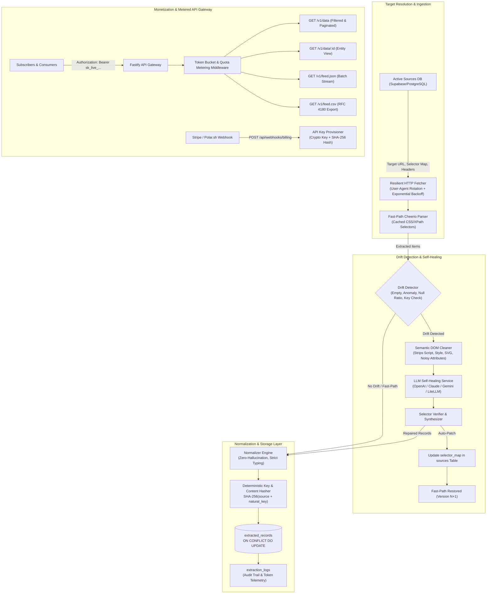

# 🚀 Autonomous Micro-DaaS Engine

An end-to-end, production-grade **Autonomous Data-as-a-Service (Micro-DaaS)** platform built in TypeScript (Node.js 22 LTS). The system autonomously scrapes, parses, normalizes, stores, and serves high-value niche structured data via a metered public API, featuring an **automated self-healing pipeline** that dynamically recovers from website layout and selector drift at near-zero LLM cost.

---

## 🏗️ Architectural Blueprint



---

## ⚡ Core Innovations & Features

1. **Self-Healing Scraping Pipeline:**
   - Routine extraction executes on the **Fast-Path** with Cheerio at sub-millisecond speeds and **\$0 LLM token cost**.
   - If website layout changes or selectors break, **Drift Detection** isolates the failure.
   - The **Semantic DOM Cleaner** strips scripts, styles, SVG, comments, and base64 blobs, reducing HTML size by >85% to minimize LLM token usage.
   - The **LLM Self-Healing Engine** extracts target items with strict Zod validation, verifies proposed selectors against the DOM, and **auto-patches** the database `selector_map`.
   - Subsequent runs automatically revert to Fast-Path with the new selectors at 0 LLM cost.

2. **Zero-Hallucination & Deterministic Deduplication:**
   - Strict normalization guarantees that raw data fields reflect source truth; missing fields are stored as `null`.
   - Deterministic entity identification: `entity_id = SHA256(source_id + '::' + natural_key)`.
   - Content hash change tracking: `hash = SHA256(canonicalJson(data))` tracks payload revisions (`version = version + 1`) without duplicate records.

3. **Public API Gateway & Monetization:**
   - Full REST API with query filters (`since`, `category`, `status`, `search`), pagination, and single item lookup.
   - Real-time batch feeds in **JSON** (`/v1/feed.json`) and **RFC 4180 CSV** (`/v1/feed.csv`).
   - Built-in **Token Bucket Rate Limiting** and monthly quota decrementing with HTTP headers (`X-Quota-Limit`, `X-Quota-Remaining`, `X-RateLimit-Limit`, `X-RateLimit-Remaining`).
   - Webhook auto-checkout receiver (`POST /api/webhooks/billing`) for Stripe and Polar.sh to provision API keys automatically upon payment confirmation.

4. **Multi-Provider LLM Support:**
   - Works with **OpenAI** (`gpt-4o-mini`, `gpt-4o`), **Anthropic** (`claude-3-5-sonnet`), **Gemini** (`gemini-1.5-flash`), **LiteLLM**, or local **Mock Heuristic Engine** for offline test execution.

---

## 🗄️ Database Schema (Supabase / PostgreSQL)

DDL migrations are located in `src/db/migrations/001_initial_schema.sql`:

- `sources`: Stores scraping targets, URL, `target_schema`, `selector_map`, `schedule_cron`, `headers`, and `status`.
- `extracted_records`: Stores normalized entities with `entity_id` PK (SHA-256), `natural_key`, `data` (JSONB), `hash`, and `version`.
- `api_subscribers`: Manages customer API keys (`api_key_hash`), `tier` (free, starter, pro, enterprise), `monthly_quota`, and `current_usage`.
- `extraction_logs`: Audit trail for every scrape: `status` (SUCCESS, DRIFT_REPAIRED, FAILED), `records_count`, `duration_ms`, and `tokens_used`.

---

## 🚀 Quick Start

### 1. Installation
```bash
pnpm install
```

### 2. Environment Setup
```bash
cp .env.example .env
```

### 3. Run Automated Tests
```bash
pnpm run test
```

### 4. Interactive Self-Healing Demonstration
Run the live simulation to see fast-path extraction, HTML layout change, drift detection, LLM self-repair, and auto-patching:
```bash
pnpm run test-drift
```

### 5. Seed Demo Data & Issue Test API Keys
```bash
pnpm run seed
```

### 6. Start the API Gateway & Worker Scheduler
```bash
# Start both API and Background Scheduler
pnpm run start

# Or start individually:
pnpm run api     # API Gateway only (port 3000)
pnpm run worker  # Background Cron Worker only
```

---

## 📡 Public API Reference

All requests require Bearer token authentication:
`Authorization: Bearer sk_live_...`

### 1. `GET /v1/data`
Query and filter normalized records.
- **Query Params:**
  - `page` (number, default: 1)
  - `limit` (number, default: 50, max: 250)
  - `source_id` (UUID)
  - `category` (string)
  - `status` (string)
  - `since` (ISO 8601 timestamp)
  - `search` (string)

**Response:**
```json
{
  "data": [
    {
      "entity_id": "a9f8b2c...",
      "source_id": "b59b1c7...",
      "natural_key": "gpu-h100-sxm5-01",
      "data": {
        "title": "NVIDIA H100 80GB SXM5",
        "price": 2.39,
        "category": "US-East-1",
        "status": "In Stock",
        "natural_key": "gpu-h100-sxm5-01"
      },
      "hash": "c8e1...",
      "version": 2,
      "first_seen_at": "2026-09-26T10:00:00.000Z",
      "updated_at": "2026-09-26T10:16:41.000Z"
    }
  ],
  "pagination": {
    "page": 1,
    "limit": 50,
    "total_records": 1,
    "total_pages": 1,
    "has_more": false
  }
}
```

### 2. `GET /v1/data/:id`
Fetch single entity by its `entity_id`.

### 3. `GET /v1/feed.json`
Bulk ingestion endpoint for high-volume consumers.

### 4. `GET /v1/feed.csv`
Streams RFC 4180 CSV with flattened headers:
```csv
"entity_id","source_id","natural_key","version","first_seen_at","updated_at","category","price","status","title"
"a9f8b2c...","b59b1c7...","gpu-h100-sxm5-01",2,"2026-09-26T10:00:00.000Z","2026-09-26T10:16:41.000Z","US-East-1","2.39","In Stock","NVIDIA H100 80GB SXM5"
```

### 5. `POST /api/webhooks/billing`
Stripe and Polar.sh webhook endpoint to auto-provision API keys upon subscriber checkout.

---

## 🐳 Docker Deployment

```bash
docker-compose up --build
```
